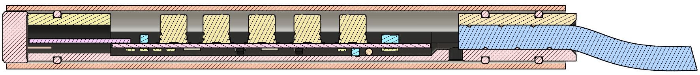
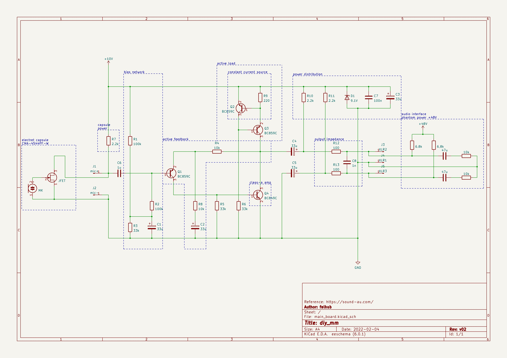
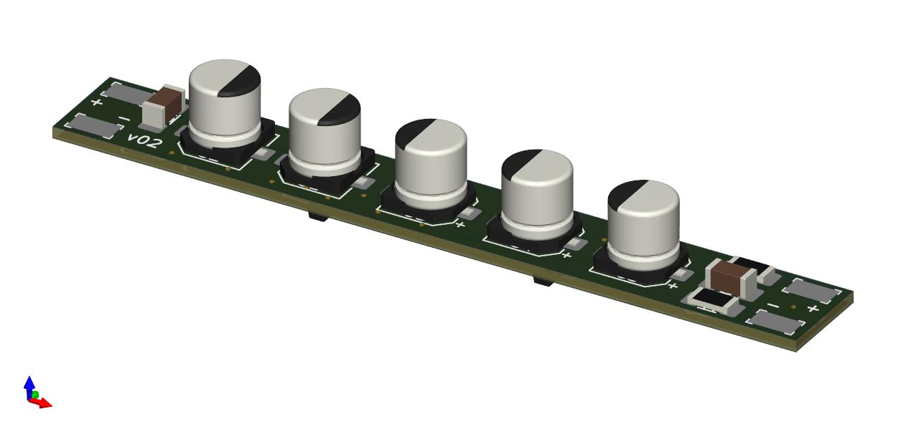
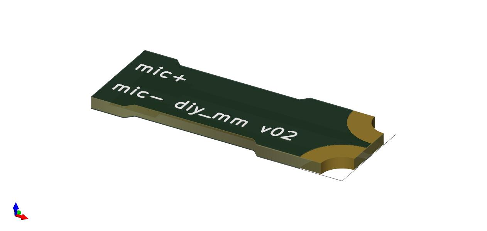
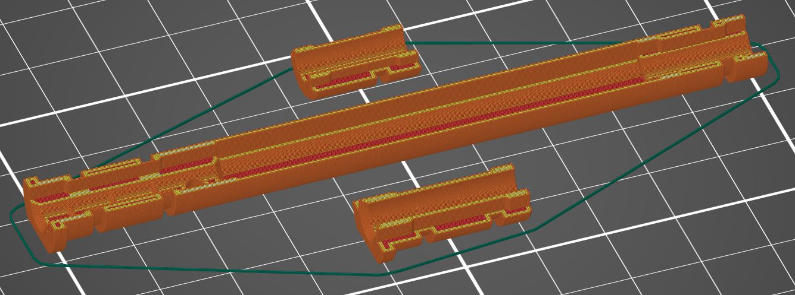

# diy_mm

Low cost measurement microphone powered by +48V phantom power using a cheap electret capsule.

## Impedance Converter and capsule adapter (kicad)

The impedance converter is based on an electret mic preamp from [Rod Elliot](https://sound-au.com/articles/mic-electret.htm). Some small changes were made to fit the converter to the capsule and to use smaller capacitors to fit it into the housing.  
In order to connect the pcb to the capsule and also to fix the capsule in place a small adapter pcb is used. This pcb is clamped in the 3d printed housing an soldered onto the converters pcb.

| main_board | capsule_adapter |
|:-----------------------------:|:----------------------------------:|
|  |  |

## LTSpice Simulation (simulation)

Alongside the changes of the converter design a LTSpice simulation was conducted. The obtained result is very good, showing linearity of &pm;0.1dB and a very true phase slowly rising below 100Hz to reach \~13&deg; at 20Hz. The impedance converter also features a signal amplification of \~3dB.

## 3D printed parts (3dfiles)

The fixture for capsule, impedance converter and strain relief if the cable are accomplished by three 3d printed parts. Using a 0.25mm nozzle the parts can be printed very accurately to perfectly fit the shielding aluminium tube using three o-rings.

Through a hole in the chassis at the strain relief side, the shielding can be fed through in order to touch the aluminium tube. The hole assembly slides tightly inside and is just hold by friction. To get it back out one has to firstly pull on the cable slightly, after the first o-ring is out one should pull on the plastic to fully slide out the main assembly.

